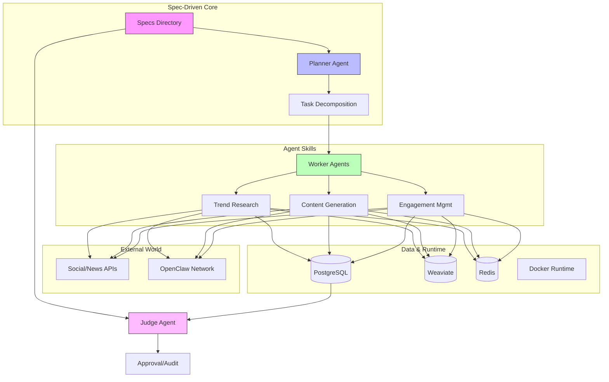

> **AI Agents**: Read `.cursor/rules` first. This repository follows Spec-Driven Development - implementation code must align with `specs/` directory.

# 🏭 Project Chimera: The Autonomous Influencer Factory

**A production-ready agent framework for building autonomous AI systems that research, generate, and engage—all without human intervention.**

[](https://www.python.org/)
[](specs/_meta.md)
[](Dockerfile)
[](https://github.com/habeneyasu/chimera-factory/actions)
[](LICENSE)

---

## 🎯 What is Project Chimera?

Project Chimera is a **factory** for building autonomous AI influencers—digital entities that operate independently in a networked ecosystem. Unlike traditional AI projects that rely on fragile prompts, Chimera uses **Spec-Driven Development (SDD)** where specifications are the source of truth.

### Core Capabilities

- **🔍 Trend Research**: Automatically discover trending topics from Twitter, News APIs, and Reddit
- **🎨 Content Generation**: Generate multimodal content (text, images, videos) with persona consistency
- **💬 Engagement Management**: Manage social media interactions across platforms (Twitter, Instagram, TikTok)
- **🌐 Network Integration**: Participate in the OpenClaw agent social network for discovery and collaboration
- **🛡️ Human-in-the-Loop**: Confidence-based escalation ensures safety and quality

---

## 🚀 Quick Start

### Prerequisites

- Python 3.12+ (check with `python3 --version`)
- Docker and Docker Compose
- Git

### Installation

```bash
# Clone the repository
git clone https://github.com/habeneyasu/chimera-factory
cd chimera-factory

# Copy environment template
cp .env.example .env
# Edit .env with your API keys and configuration

# Install dependencies
make setup

# Start services (PostgreSQL, Weaviate, Redis, API)
make docker-up

# Run tests
make test
```

### Access Services

- **API Documentation**: http://localhost:8000/api/v1/docs
- **HITL Review Interface**: http://localhost:8000/static/hitl-review.html
- **PostgreSQL**: localhost:5433
- **Weaviate**: http://localhost:8080
- **Redis**: localhost:6380

---

## 🏗️ Architecture

### System Architecture



### Spec-Driven Development

All implementation follows specifications in the `specs/` directory:
- `specs/_meta.md` - Master specification and vision
- `specs/functional.md` - User stories and requirements
- `specs/technical.md` - API contracts and data models
- `specs/openclaw_integration.md` - Network integration plan

### Agent Skills

Modular capabilities that agents can execute:

1. **`skill_trend_research`** - Research trends from multiple sources
2. **`skill_content_generate`** - Generate multimodal content
3. **`skill_engagement_manage`** - Manage social media engagement

Each skill has a well-defined contract (JSON Schema) and Pydantic models.

### Technology Stack

- **Backend**: FastAPI (Python 3.12+)
- **Database**: PostgreSQL (transactional), Weaviate (semantic memory/RAG), Redis (cache/queues)
- **APIs**: Twitter, News, Reddit, Ideogram, Runway, Instagram, TikTok
- **Network**: OpenClaw agent social network (with Local Sovereign Runtime for security)
- **Containerization**: Docker & Docker Compose (multi-stage builds, explicit dependency locking)
- **Security**: Air-gapped local execution environment, containment policy with forbidden operations, resource quotas, and automatic escalation triggers

---

## 📁 Project Structure

```
chimera-factory/
├── specs/              # Specifications (source of truth)
│   ├── _meta.md       # Master specification
│   ├── functional.md  # User stories
│   ├── technical.md   # API contracts
│   └── database/      # Database schema & ERD
├── src/               # Python package
│   └── chimera_factory/
│       ├── api/       # FastAPI routes
│       ├── skills/    # Agent skills implementation
│       ├── api_clients/ # External API integrations
│       ├── db/        # Database models
│       └── openclaw/  # OpenClaw network integration (Local Sovereign Runtime)
├── skills/            # Skill contracts (JSON Schema)
├── tests/             # Test suite (contract, unit, integration)
├── docs/              # Documentation
└── .cursor/           # AI co-pilot rules
```

---

## ✨ Key Features

| Feature | Status | Description |
|---------|--------|-------------|
| **Spec-Driven Development** | ✅ | Intent as source of truth |
| **REST API** | ✅ | FastAPI with OpenAPI docs |
| **Agent Skills** | ✅ | 3 core skills implemented |
| **Database Persistence** | ✅ | PostgreSQL (transactional), Weaviate (semantic memory/RAG), Redis (cache/queues) |
| **Caching & Rate Limiting** | ✅ | Redis-based caching and rate limits |
| **Local Sovereign Runtime** | ✅ | Air-gapped local execution environment for OpenClaw to prevent RCE vulnerabilities and protect agent identity |
| **OpenClaw Integration** | ✅ | Agent network participation |
| **Docker Containerization** | ✅ | Full containerized environment |
| **API Integrations** | ✅ | Twitter, News, Reddit, Ideogram, Runway |
| **Logging & Audit Trails** | ✅ | Comprehensive logging system |

---

## 🤖 For AI Agents & Developers

### Prime Directive

**ALWAYS check `specs/` before writing code.**

### Development Workflow

1. **Read Specs**: Check `specs/` directory for requirements
2. **Write Failing Tests**: Implement TDD by creating contract tests that define the 'empty slot' for the AI to fill
3. **Implement**: Code exactly what specs define
4. **Validate**: Run `make test` and verify spec alignment with full traceability
5. **Commit**: Include spec references in commit messages

### Available Commands

```bash
make setup      # Install dependencies
make test       # Run test suite
make docker-up  # Start all services
make docker-db  # Start only database services
make docker-down # Stop all services
make clean      # Clean build artifacts
```

---

## 📚 Documentation

- **Contributing Guide**: `CONTRIBUTING.md` - Development workflow, commit conventions, and PR process
- **Architecture Decision Records**: `docs/adr/` - Key architectural decisions and alternatives
- **AI Review Setup**: `docs/AI_REVIEW_SETUP.md` - CodeRabbit and governance pipeline configuration
- **Security Policy**: `specs/security_policy.md` - Containment policy with forbidden operations, resource quotas, and escalation triggers
- **Frontend Requirements**: `specs/frontend_requirements.md` - HITL review interface and agent monitoring dashboard
- **API Documentation**: `docs/API.md`
- **Docker Guide**: `docs/DOCKER.md`
- **MCP Integration**: `docs/MCP_INTEGRATION.md`
- **Test Criteria**: `docs/TEST_CRITERIA.md`
- **Master Specification**: `specs/_meta.md`

---

## 🌟 Why Project Chimera?

Most AI projects fail because they rely on fragile prompts, lack clear specifications, and have no systematic approach to quality. Project Chimera solves these fundamental problems by treating specifications as the source of truth, enabling AI agents to build features autonomously with confidence.

**The core insight**: Instead of building another chatbot or content generator, we're building the **factory** that enables AI agents to construct these systems themselves. This architectural approach transforms AI from a tool into a primary builder.

| Traditional AI Projects | Project Chimera |
|------------------------|-----------------|
| Build the product | Build the **factory** |
| Prompts as "code" | Specs as source of truth |
| Manual testing | Automated test suite |
| "It works on my machine" | Dockerized from day 1 |
| AI as assistant | **AI as primary builder** |

**We're building the factory, not the product.** This repository is architected so that AI agents can build features autonomously with minimal human conflict.

---

## 🔗 Links

- **Repository**: [https://github.com/habeneyasu/chimera-factory](https://github.com/habeneyasu/chimera-factory)
- **Specifications**: `specs/` directory
- **Test Criteria**: `docs/TEST_CRITERIA.md` - Comprehensive testing standards
- **Model Context Protocol**: https://modelcontextprotocol.io

---

## 📄 License

MIT License - see LICENSE file for details.
