# 🏭 Project Chimera: The Autonomous Influencer Factory

**Build digital influencers that research trends, generate content, and manage engagement—autonomously.**

[](https://www.python.org/)
[](LICENSE)
[](specs/_meta.md)
[](.cursor/mcp.json)

---

## ❌ The Problem

Most AI projects fail because they:
- Rely on fragile prompts that break at scale
- Have messy, unmaintainable codebases
- Hallucinate when specifications are ambiguous
- Lack traceability and governance

## ✅ The Solution

Project Chimera is a **factory** for autonomous AI influencers:
- **Spec-Driven Development**: Intent is the source of truth
- **Agentic Orchestration**: Hierarchical swarm architecture (Planner-Worker-Judge)
- **Governance First**: CI/CD, Docker, failing tests ensure reliability
- **Network Integration**: Active participation in OpenClaw agent social network
- **Human-in-the-Loop**: Confidence-based escalation for safety

**This isn't another chatbot. This is a factory architected so that a swarm of AI agents can build features with minimal human conflict.**

---

## 🏗️ Architecture

### Agent Pattern: FastRender Swarm

```
┌─────────────┐
│   Planner   │ ← Decomposes goals, maintains state
└──────┬──────┘
       │
┌──────▼──────┐
│   Worker    │ ← Stateless executors (parallel, scalable)
└──────┬──────┘
       │
┌──────▼──────┐
│    Judge    │ ← Quality assurance, validates outputs
└─────────────┘
```

**Key Components**:
- **Spec-Driven Development (SDD)**: All code aligns with `specs/` directory
- **Model Context Protocol (MCP)**: Universal interface for external interactions
- **Skills Architecture**: Modular capabilities (trend research, content generation, engagement)
- **Hybrid Database**: PostgreSQL (structured), MongoDB (semi-structured), TimescaleDB (time-series)

---

## 🚀 Quick Start

```bash
# Clone the repository
git clone https://github.com/habeneyasu/chimera-factory
cd chimera-factory

# Install dependencies
make setup

# Run tests (Docker-based)
make test

# Validate specifications
make spec-check

# Verify MCP integration
# See docs/MCP_INTEGRATION.md
```

**Prerequisites**:
- Python 3.12+
- Node.js and npx (for MCP servers)
- Docker and Docker Compose
- Cursor IDE (or compatible MCP client)

---

## 📁 Repository Structure

```
chimera-factory/
├── .cursor/              # IDE configuration and AI co-pilot rules
│   ├── rules            # Prime Directive: "NEVER code without checking specs/"
│   └── mcp.json         # MCP server configuration
├── docs/                 # Documentation
│   ├── MCP_INTEGRATION.md
│   └── mcp.json.example
├── research/             # Research findings and architecture strategy
│   ├── architecture_strategy.md
│   ├── tooling_strategy.md
│   └── submission_report_feb4.md
├── specs/                # Specifications (SDD source of truth)
│   ├── _meta.md         # Master specification
│   ├── functional.md    # User stories (21 stories)
│   ├── technical.md     # API contracts and data models
│   ├── openclaw_integration.md
│   ├── api/             # OpenAPI specifications
│   ├── database/        # Database schemas and ERD
│   └── skills/          # Skill contract definitions
├── skills/               # Agent runtime capabilities
│   ├── skill_trend_research/
│   ├── skill_content_generate/
│   └── skill_engagement_manage/
├── src/                  # Python package (SDD-compliant)
│   └── chimera_factory/
├── tests/                # Test suite (TDD approach)
└── pyproject.toml        # Project configuration
```

---

## 🤖 For AI Agents

**Prime Directive**: **ALWAYS check `specs/` before writing code.**

### 1. Read These First:
- `specs/_meta.md` - Project vision and constraints
- `specs/functional.md` - User stories and acceptance criteria
- `specs/technical.md` - API contracts and data models
- `.cursor/rules` - Development rules and patterns

### 2. Follow Spec-Driven Development:
- **NEVER** write code without checking specs first
- **ALWAYS** explain your plan before implementation
- **REFERENCE** spec sections in code comments
- **VALIDATE** with `make spec-check` before committing

### 3. Traceability:
- MCP Sense tracks all changes (Tenx integration)
- Commit messages must reference spec sections
- All actions logged for audit trail

**See `.cursor/rules` for complete AI co-pilot guidelines.**

---

## 🔄 Development Workflow

```mermaid
graph LR
    A[Read Specs] --> B[Write Failing Tests]
    B --> C[Implement Feature]
    C --> D[Run Tests]
    D --> E{All Tests Pass?}
    E -->|Yes| F[Commit with Context]
    E -->|No| C
    F --> G[Push → CI/CD Runs]
    G --> H[Spec Validation]
```



**Workflow Steps**:
1. **Check Specs**: Read relevant specifications in `specs/`
2. **Plan Implementation**: Explain approach with spec references
3. **Write Tests**: Create tests based on acceptance criteria (TDD)
4. **Implement**: Code exactly what specs define
5. **Validate**: Run `make spec-check` and `make test`
6. **Commit**: Include spec references in commit messages

---

## ✨ Key Features

| Feature | Description | Status |
|---------|-------------|--------|
| **Spec-Driven Dev** | Intent as source of truth | ✅ Implemented |
| **MCP Integration** | Universal tool interface (3 dev servers) | ✅ Connected |
| **FastRender Swarm** | Planner-Worker-Judge pattern | 📋 Spec Complete |
| **Agent Skills** | Modular capabilities (3 critical skills) | 📋 Contract Defined |
| **OpenClaw Network** | Agent social protocols | 📋 Spec Complete |
| **Human-in-the-Loop** | Confidence-based approval workflow | 📋 Spec Complete |
| **Hybrid Database** | PostgreSQL + MongoDB + TimescaleDB | 📋 Schema Defined |
| **Docker Testing** | Containerized test environment | ✅ Implemented |

---

## 🌟 Why This Isn't Another AI Project

1. **We're building the factory, not the product**
   - Infrastructure enables autonomous agent development
   - Specs define intent, agents implement features

2. **AI agents can build the final features**
   - Repository architected for swarm development
   - Clear boundaries between development tools and runtime capabilities

3. **Every decision is spec-ratified**
   - No code without specifications
   - Traceability from spec to implementation

4. **Full traceability via MCP Sense**
   - "Black box" recording of all development activities
   - Complete audit trail for governance

5. **Network-first architecture**
   - Agents participate in OpenClaw social network
   - Discover, collaborate, and share with other agents

---

## 📊 Project Status

**Task 1 - The Strategist** ✅ **COMPLETE**
- [x] Environment setup and Git repository initialization
- [x] Research and reading (SRS, OpenClaw, MoltBook, a16z)
- [x] Architecture strategy documentation
- [x] MCP integration and verification
- [x] Submission report

**Task 2 - The Architect** 🚧 **IN PROGRESS**
- [x] Master specification (`specs/_meta.md`)
- [x] Functional specifications (`specs/functional.md` - 21 user stories)
- [x] Technical specifications (`specs/technical.md` - API contracts)
- [x] Database schema with ERD (`specs/database/`)
- [x] OpenClaw integration plan (`specs/openclaw_integration.md`)
- [x] Context engineering (`.cursor/rules`)
- [x] Developer tools documentation (`research/tooling_strategy.md`)
- [x] Agent skills structure (`skills/` - 3 critical skills)

---

## 📚 Documentation

### Core Documentation
- **Master Specification**: `specs/_meta.md` - Project vision and constraints
- **Functional Specs**: `specs/functional.md` - 21 user stories from agent perspective
- **Technical Specs**: `specs/technical.md` - API contracts and data models
- **Database Schema**: `specs/database/schema.sql` - Complete schema with video metadata
- **OpenClaw Integration**: `specs/openclaw_integration.md` - Network participation plan

### Architecture & Research
- **Architecture Strategy**: `research/architecture_strategy.md`
- **Tooling Strategy**: `research/tooling_strategy.md` - MCP vs Skills separation
- **Research Notes**: `research/research_notes.md`
- **Submission Report**: `research/submission_report_feb4.md`

### Development Guides
- **MCP Integration**: `docs/MCP_INTEGRATION.md` - Setup and verification
- **AI Co-Pilot Rules**: `.cursor/rules` - Development guidelines
- **Skills Documentation**: `skills/README.md` - Agent capabilities

---

## 🤝 Contributing

This project follows **Spec-Driven Development (SDD)**:

### For Developers:
1. **NEVER** write code without checking `specs/` first
2. **ALWAYS** write failing tests before implementation (TDD)
3. **COMMIT** early and often with descriptive messages
4. **REFERENCE** spec sections in code comments

### For AI Agents:
- Follow `.cursor/rules` strictly
- Reference spec sections in commits
- Use `make spec-check` to validate alignment
- Explain your plan before writing code

### Development Commands:
```bash
make setup      # Install dependencies
make test       # Run tests in Docker
make spec-check # Validate spec alignment
make clean      # Clean build artifacts
```

---

## 🔗 Links

- **Repository**: [https://github.com/habeneyasu/chimera-factory](https://github.com/habeneyasu/chimera-factory)
- **Specifications**: `specs/` directory
- **MCP Integration**: `docs/MCP_INTEGRATION.md`
- **Model Context Protocol**: https://modelcontextprotocol.io
- **MCP Server Registry**: https://github.com/modelcontextprotocol/servers

---

## 📄 License

See LICENSE file for details.

---

**Built with ❤️ following Spec-Driven Development principles. Every line of code traces back to a specification.**
