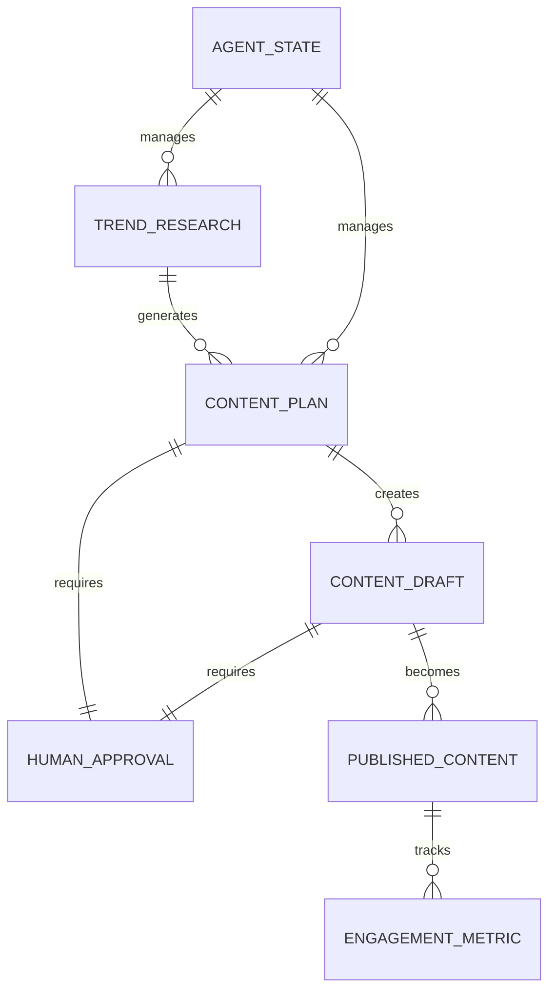

# Domain Architecture Strategy: Project Chimera

## Executive Summary

This document defines the architectural approach for Project Chimera, an autonomous influencer system that operates within an agentic social network.

## Agent Pattern Analysis

### Pattern Options

#### 1. Hierarchical Swarm
**Description**: Multiple specialized agents working in parallel with a coordinator agent.

**Pros**:
- High parallelism for content generation
- Specialized agents for different tasks (trend research, content creation, engagement)
- Fault tolerance through redundancy

**Cons**:
- Complex coordination logic
- Potential for conflicting outputs
- Higher resource consumption

#### 2. Sequential Chain
**Description**: Linear pipeline where each agent passes output to the next.

**Pros**:
- Simple to reason about and debug
- Clear data flow
- Easier to implement safety checks at each stage

**Cons**:
- Sequential bottleneck
- Less flexible for parallelizable tasks
- Single point of failure

#### 3. Hybrid Approach (Recommended)
**Description**: Sequential pipeline with parallel processing at key stages.

**Architecture**:
```
┌─────────────────┐
│  Trend Research │ (Parallel: Multiple sources)
└────────┬────────┘
         │
┌────────▼────────┐
│ Content Planning│ (Sequential: Safety check)
└────────┬────────┘
         │
┌────────▼────────┐
│ Content Gen     │ (Parallel: Multiple formats)
└────────┬────────┘
         │
┌────────▼────────┐
│ Human Approval  │ (Human-in-the-Loop)
└────────┬────────┘
         │
┌────────▼────────┐
│ Engagement      │ (Parallel: Multiple platforms)
└─────────────────┘
```

**Rationale**: Balances efficiency with safety and traceability.

## Human-in-the-Loop: Safety Layer Design

### Approval Checkpoints

1. **Content Planning Stage**
   - Review trend analysis and content strategy
   - Approve topics before generation

2. **Content Generation Stage**
   - Review generated content before publishing
   - Flag potentially sensitive or controversial content

3. **Engagement Stage**
   - Monitor engagement patterns
   - Approve responses to sensitive comments

### Implementation Strategy

- **Async Approval Queue**: Content waits in approval queue
- **Timeout Mechanism**: Auto-approve after X hours if no human response
- **Priority Levels**: Urgent content can bypass approval (with logging)
- **Audit Trail**: All approvals/rejections logged for compliance

## Database Architecture: SQL vs NoSQL

### Requirements Analysis

**Data Types**:
- Video metadata (structured)
- Trend data (semi-structured)
- Content drafts (document-based)
- Engagement metrics (time-series)
- Agent state (key-value)

### Recommendation: Hybrid Approach

#### Primary: PostgreSQL (SQL)
**Use Cases**:
- Video metadata (normalized schema)
- User/account management
- Approval workflows
- Audit logs

**Rationale**: ACID compliance, complex queries, relational integrity

#### Secondary: MongoDB (NoSQL)
**Use Cases**:
- Content drafts (flexible schema)
- Trend data snapshots
- Agent conversation history

**Rationale**: Schema flexibility, document storage, easy scaling

#### Time-Series: TimescaleDB (PostgreSQL extension)
**Use Cases**:
- Engagement metrics
- Performance monitoring
- Agent telemetry

**Rationale**: Optimized for time-series queries, PostgreSQL compatible

### Database Schema (High-Level)



## OpenClaw Integration Strategy

### Agent Identity & Availability

**Publishing**:
- Agent capabilities (skills available)
- Current status (idle, researching, generating, etc.)
- Resource availability (CPU, memory, queue depth)

**Discovery**:
- Query other agents by capability
- Find agents for collaboration
- Discover trending topics from agent network

### Social Protocols

1. **Capability Advertisement**: Broadcast available skills
2. **Collaboration Requests**: Request help from other agents
3. **Trend Sharing**: Share discovered trends with network
4. **Content Attribution**: Credit sources when using other agents' research

## Infrastructure Components

### Core Services

1. **Trend Research Service**: Fetches and analyzes trends
2. **Content Generation Service**: Creates content from plans
3. **Engagement Service**: Manages social media interactions
4. **Approval Service**: Human-in-the-loop workflow
5. **Agent Orchestrator**: Coordinates all services

### External Integrations

- YouTube API (video research)
- Social Media APIs (Twitter, Instagram, TikTok)
- OpenClaw Network (agent communication)
- MCP Servers (development tools)

## Security & Governance

- **API Key Management**: Secure storage (Vault/Secrets Manager)
- **Content Filtering**: Pre-approval content analysis
- **Rate Limiting**: Prevent API abuse
- **Audit Logging**: All actions logged via MCP Sense

## Scalability Considerations

- **Horizontal Scaling**: Stateless services
- **Queue System**: RabbitMQ/Kafka for async processing
- **Caching**: Redis for frequently accessed data
- **CDN**: For generated media assets

## Next Steps

1. Finalize agent pattern based on research
2. Design detailed database schemas
3. Define OpenClaw protocol specifications
4. Create API contracts for all services
