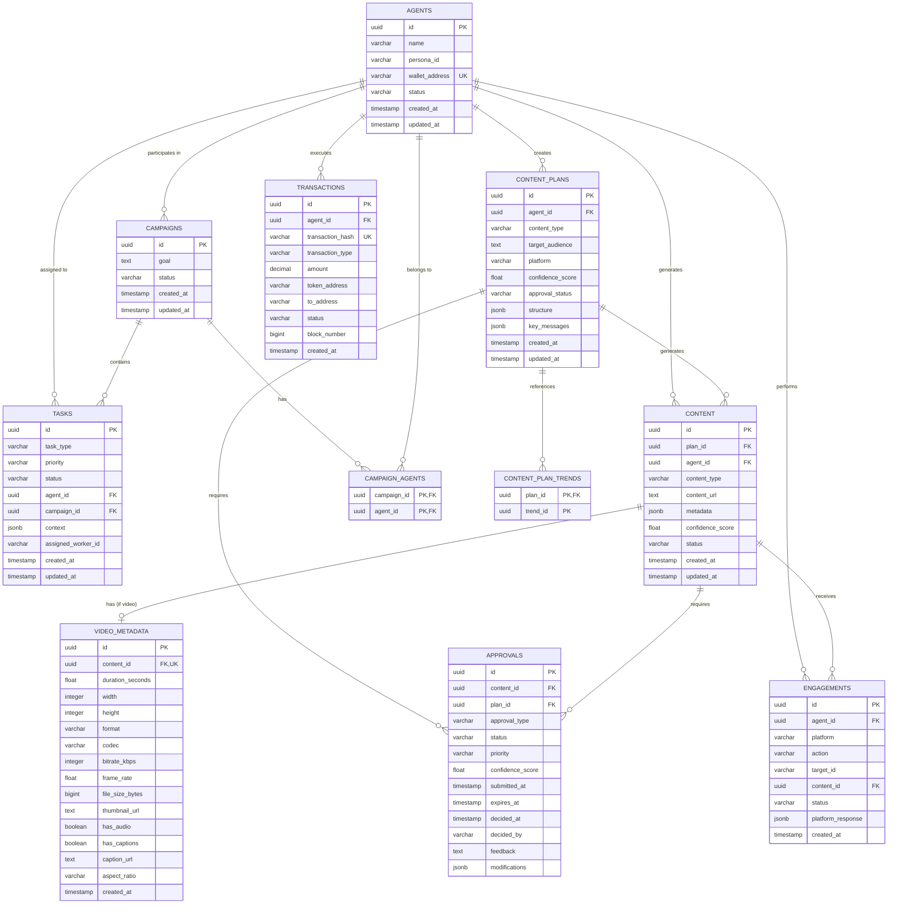

# Entity Relationship Diagram: Project Chimera Database

**Prepared By**: habeneyasu  
**Repository**: [https://github.com/habeneyasu/chimera-factory](https://github.com/habeneyasu/chimera-factory)  
**Last Updated**: February 2026

---

## ERD Diagram

---

## Key Relationships

### Content Flow
1. **Trend Research** → `CONTENT_PLANS` (via `CONTENT_PLAN_TRENDS`)
2. **Content Planning** → `CONTENT_PLANS` (created by agents)
3. **Approval** → `APPROVALS` (for plans and content)
4. **Content Generation** → `CONTENT` (from approved plans)
5. **Video Metadata** → `VIDEO_METADATA` (for video content only)
6. **Engagement** → `ENGAGEMENTS` (on published content)

### Video Metadata Storage

Video metadata is stored in a **normalized table** (`VIDEO_METADATA`) that:
- Has a **one-to-one relationship** with `CONTENT` (only for video content)
- Stores structured video-specific fields (duration, resolution, codec, etc.)
- Allows efficient querying of video properties
- Supports video-specific operations (thumbnails, captions, etc.)

### Approval Workflow

The approval system supports:
- **Content Plans**: Approval before content generation
- **Generated Content**: Approval before publishing
- **Human-in-the-Loop**: Three-tier confidence-based escalation
- **Auto-Approval**: For high-confidence content (>0.90)
- **Timeout Mechanism**: Auto-approve after expiration

---

## Database Design Principles

1. **Normalization**: Video metadata is normalized into a separate table for efficient querying
2. **Flexibility**: JSONB fields store flexible metadata (structure, key_messages, etc.)
3. **Traceability**: All relationships maintain foreign keys for audit trails
4. **Performance**: Indexes on frequently queried fields (status, agent_id, content_type)
5. **Scalability**: UUID primary keys support distributed systems

---

## Video Metadata Schema Details

The `VIDEO_METADATA` table stores comprehensive video information:

- **Technical Properties**: duration, resolution (width/height), format, codec, bitrate, frame rate
- **File Information**: file size, thumbnail URL
- **Accessibility**: audio presence, caption availability, caption URL
- **Display**: aspect ratio (16:9, 9:16, 1:1 for different platforms)

This normalized structure enables:
- Efficient queries for video content by technical properties
- Platform-specific optimization (TikTok: 9:16, YouTube: 16:9)
- Content discovery by video characteristics
- Analytics on video performance by metadata

---

## References

- **Database Schema**: `specs/database/schema.sql`
- **Technical Specifications**: `specs/technical.md`
- **Functional Specifications**: `specs/functional.md`
- **Master Specification**: `specs/_meta.md`

---

**This ERD represents the complete database structure for Project Chimera, including normalized video metadata storage.**
